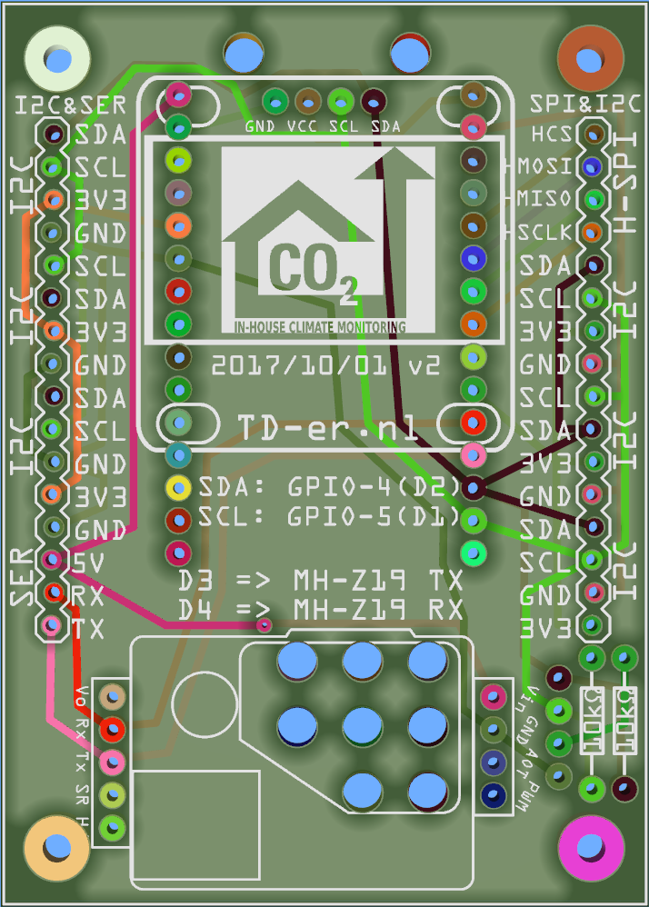
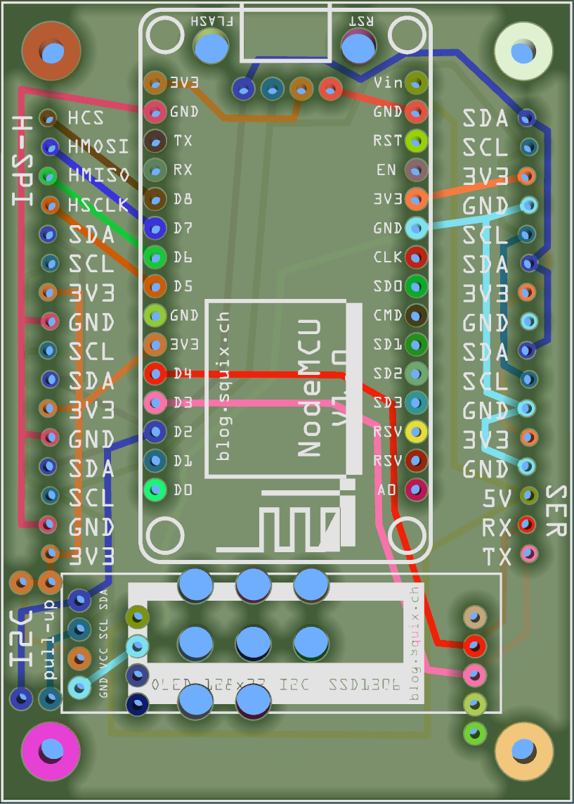

# NodeMCU_PCB
PCB Design of a test print to be used with the NodeMCU v1.0 and numerous I2C components and OLED displays and a MH-Z19 CO2 sensor

Some Fritzing parts I used, I made myself. See: https://github.com/TD-er/fritzing-parts

## Inspect before production

Rev 1 of the PCB appeared to have incorrect hole diameter for the NodeMCU, so that board should not be produced by anyone.
Too bad I discovered this after production of the PCB.
For the rev. 2 of this board, I used the free Gerber PCB viewer [ZofzPCB](https://www.zofzpcb.com/)
This viewer can inspect all hole diameters and net routes.
Also the distances between holes are easy to inspect.

Too bad loading the Gerber files takes about 25 minutes on my Core i7 laptop. Therefore the Zofz project file is also included.

## Rev 2 PCB

 

The screenshots are taken from the free Gerber PCB viewer ZofzPCB.

This board has room for:
* OLED I2C display with GND, Vcc, SCL, SDA pinout 
* NodeMCU v1.0 positioned on the bottom of the PCB.
* [MH-Z19](http://www.winsen-sensor.com/products/ndir-co2-sensor/mh-z19.html) or [SenseAir S8](https://senseair.com/products/size-counts/s8-residential/) CO2 sensor.
* Numerous I2C pinout combinations for almost all sensor sold at webshops.
* Two pull-up resistors for the I2C lines.
* Easy access to pins 5V, D3 and D4 (used as RX/TX when CO2 sensor is connected)
* Easy access to hardware SPI pins

### Suitable enclosure
The PCB fits exactly in the [75 x 54 x 27mm ABS plastic case](https://www.banggood.com/10pcs-DIY-Plastic-Project-Housing-Electronic-Junction-Case-Power-Supply-Box-p-1168741.html?p=1712161907732201507C) with the USB port of the NodeMCU in front of the hole in the case.
Even the OLED displays fit exactly when using these [pinheaders](https://www.banggood.com/10pcs-40Pin-2_54mm-Female-Header-Connector-Socket-For-DIY-Arduino-p-945516.html?p=1712161907732201507C).
Only a hole has to be made inside the case for the display.

### Holes and their use
There are holes in the PCB at the position of the flash and reset buttons of the NodeMCU. These can be used to ease drilling holes in the bottom of the plastic case before soldering the NodeMCU.

The holes under the CO2 sensor are needed to supply the air to the Senseair S8 CO2 sensor. When using the MH-Z19 CO2 sensor, they are not needed, but more ventilation is always a good thing when sensing air quality.

### I2C connections and pull-up resistors
The I2C pins at both sides (left/right) of the board appear random, but they can support almost any I2C sensor board available online.
Most of these boards use different order of pinout signals.
The same order is positioned on the left and on the right, to allow for sensor boards which have the sensor on the "other" side. Some sensors you may want to direct to the outside of the box (e.g. temperature sensor).

There is room for 2 resistors.
Often I2C needs additional pull-up resistors to function well. A good value for 100 kHz I2C is a 10k resistor. One for the clock line and one for the data line.

### OLED displays
There is room for a small display at the same side as the NodeMCU and a bigger one at the "top" side of the PCB.
Make sure to solder the pin-header for the bigger display first and then the NodeMCU.
Please note there are OLED displays with other pinouts. I used the GND, Vcc, SCL, SDA variant.
