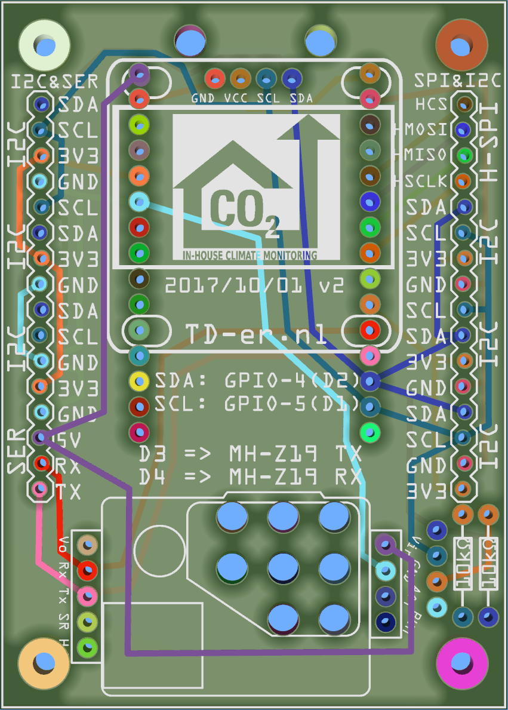

# NodeMCU_PCB
PCB Design of a test print to be used with the NodeMCU v1.0 and numerous I2C components and OLED displays and a MH-Z19 CO2 sensor

Some Fritzing parts I used, I made myself. See: https://github.com/TD-er/fritzing-parts

## Inspect before production

Rev 1 of the PCB appeared to have incorrect hole diameter for the NodeMCU, so that board should not be produced by anyone.
Too bad I discovered this after production of the PCB.
For the rev. 2 of this board, I used the free Gerber PCB viewer [ZofzPCB](https://www.zofzpcb.com/)
This viewer can inspect all hole diameters and net routes.
Also the distances between holes are easy to inspect.

Too bad loading the Gerber files takes about 25 minutes on my Core i7 laptop. Therefore the Zofz project file is also included.

## Rev 2 PCB

 

The screenshots are taken from the free Gerber PCB viewer ZofzPCB.

This board has room for:
* OLED I2C display with GND, Vcc, SCL, SDA pinout 
* NodeMCU v1.0 positioned on the bottom of the PCB.
* [MH-Z19](http://www.winsen-sensor.com/products/ndir-co2-sensor/mh-z19.html) or [SenseAir S8](https://senseair.com/products/size-counts/s8-residential/) CO2 sensor.
* Numerous I2C pinout combinations for almost all sensor sold at webshops.
* Two pull-up resistors for the I2C lines.

The PCB fits exactly in the [75 x 54 x 27mm ABS plastic case](https://www.banggood.com/10pcs-DIY-Plastic-Project-Housing-Electronic-Junction-Case-Power-Supply-Box-p-1168741.html?p=1712161907732201507C) with the USB port of the NodeMCU in front of the hole in the case.
Even the OLED displays fit exactly when using these [pinheaders](https://www.banggood.com/10pcs-40Pin-2_54mm-Female-Header-Connector-Socket-For-DIY-Arduino-p-945516.html?p=1712161907732201507C).
Only a hole has to be made inside the case for the display.

